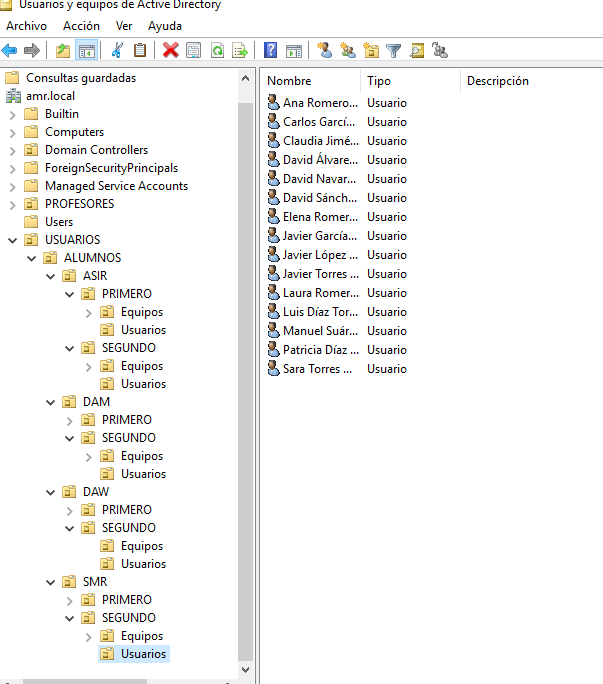
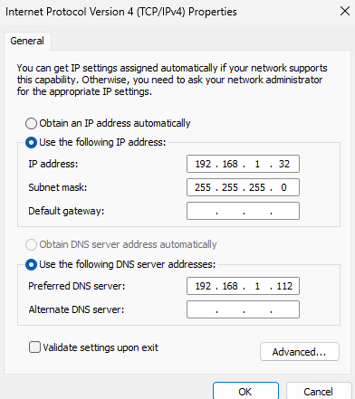
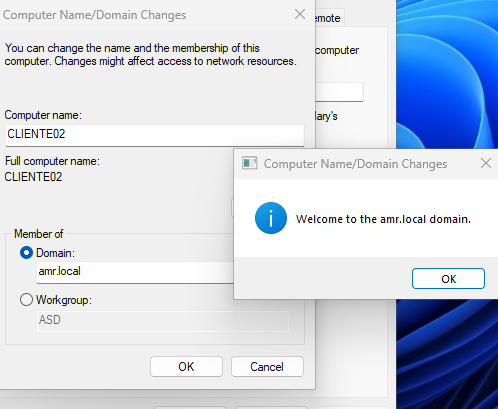
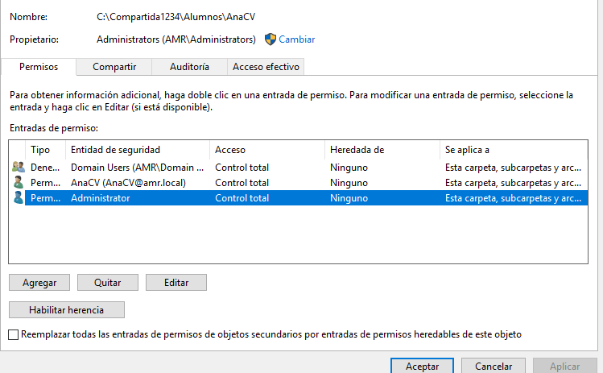

### Nombre del dominio
**Nombre:** AMR.local

### Detalles del controlador 

**NetBios:** AMR
**Contraseña:** Villabalter1
**Sistema utilizado:** Windows Server 2019 Datacenter Evaluation
**Nivel funcional:** Windows Server 2016 

#### Roles utilizados
✔ **Servicios de dominio de Active Directory**
✔ **Servidor DNS**

### Carpetas utilizadas por el sistema

*Hemos usado las **carpetas por defecto***

**BDD:** C:\Windows\NTDS
**Registros:** C:\Windows\NTDS
**SYSVOL**:\Windows\SYSVOL

## Estructura del dominio

- AMR  
  - USUARIOS
    - **ALUMNOS**
      - **ASIR**
        - PRIMERO
          - OU=Usuarios (30 USUARIOS)
          - OU=Equipos (15 EQUIPOS W-10)
          - GRUPO ASIR1
        - SEGUNDO
          - OU=Usuarios (15 USUARIOS)
          - OU=Equipos (15 EQUIPOS W-10)
          - GRUPO ASIR2
      - **SMR**
        - PRIMERO
          - OU=Usuarios (30 USUARIOS)
          - OU=Equipos (15 EQUIPOS W-10)
          - GRUPO SMR1
        - SEGUNDO
          - OU=Usuarios (15 USUARIOS)
          - OU=Equipos (15 EQUIPOS W-10)
          - GRUPO SMR2
      - **DAW**
        - PRIMERO
          - OU=Usuarios (30 USUARIOS)
          - OU=Equipos (15 EQUIPOS W-10)
          - GRUPO DAW1
        - SEGUNDO
          - OU=Usuarios (15 USUARIOS)
          - OU=Equipos (15 EQUIPOS W-10)
          - GRUPO DAW2
      - **DAM**
        - PRIMERO
          - OU=Usuarios (30 USUARIOS)
          - OU=Equipos (15 EQUIPOS W-10)
          - GRUPO DAM1
        - SEGUNDO
          - OU=Usuarios (15 USUARIOS)
          - OU=Equipos (15 EQUIPOS W-10)
          - GRUPO DAM2
  - **PROFESORES**
    - OU=Usuarios (15 Profesores)
    - OU=Equipos (Equipos de profesores)
  
Nos quedaria algo así 


#### Alumnos

Tendremos un archivo llamado **alumnos.csv** y este mismo contendrá todos los alumnos del dominio, por lo que lo ideal será crearles unas carpetas personales de forma automatica.

#### Carpetas grupales

Antes de crear nuestro script y añadir los usuarios crearemos una carpeta compartida para los diferentes grupos, entre ellos **ASIR, DAM, DAW, PROFESORES** y **ADMINISTRACION**.

Para ello crearemos una nueva OU llamada **GRUPOS** y la estructuraremos de la siguiente manera

- OU=Grupos
  - CN=Profesores (Grupo)
  - CN=SMR1 (Grupo)
  - CN=SMR2 (Grupo)
  - CN=ASIR1 (Grupo)
  - CN=ASIR2 (Grupo)
  - CN=DAW1 (Grupo)
  - CN=DAW2 (Grupo)
  - CN=DAM1 (Grupo)
  - CN=DAM2 (Grupo)

## Script

Crearemos el [script](scriptusuariosperso.ps1)

A parte de crear nuestro script, también crearemos en la carpeta **NETLOGON** un archivo llamado "**conecta.bat**" para que nuestros ordenadores puedan conectarse a la letra elegida, en nuestro caso será la **H:**

```bat
net use H:\\Servidor\Compartida\Alumnos\%username%
```
## Conectaremos el equipo al dominio


Confirmacion


Veremos el resultado del script desde el equipo que hemos conectado recientemente


## Unidades Organizativas usadas dentro del dominio

He decidido que las mejores GPOs que podemos usar son: 

### Configuraciones de seguridad del dominio
#### 💻 Politicas de cuenta
- 📜 Longitud minima de contraseña: 12 caracteres
- 📜 Complejidad de contraseña: Obligatoria
- 📜 Caducidad de contraseña: 90 dias
- 📜 Historial de contraseñas Almacenar ultimas 2
- 📜 Bloqueos de cuentas
  - 5 intentos
  - 30 minutos de duracion
  - 30 minutos restablecer contador 

#### 🥋 Politicas de seguridad / ALUMNOS
##### Politicas de acceso y restriccion
- 📜 Deshabilitar CMD y Powershell
- 📜 Acceso restringido a herramientas administrativas
- 📜 Acceso a red interna unicamente mediante credenciales 
- 📜 Deshabilitacion de ejecucion de scripts no firmados
- 📜 Deshabilitacion del panel de control (de este modo no nos podran alterar nada del sistema)
- 📜 Prohibición almacenamiento de archivos en escritorio

###### Nivel de entorno y configuracion de escritorio
  📜 Redireccipn de carpetas personales a (H:)
- 📜 Bloqueo de sesión tras 5 minutos de inactividad

#### 🧑‍🏫 Politicas de seguridad / PROFESORES
##### Politicas de acceso y restriccion
- 📜 Permitir acceso a CMD y Powershell
- 📜 Acceso a herramientas administrativas
- 📜 Acceso a unidades externa
  
###### Configuracion de escritorio y entorno
- 📜 Permiso para almacenar archivos en escritorio
- 📜 Habilitación de bloqueo de sesión tras 5 minutos (asi evitaremos que los alumnos puedan interactuar con el ordenador del profesor)

#### Auditoria

Añadiremos el registro de eventos para poder tener cierto control sobre lo que pasa en nuestro dominio.

-  **Registro de eventos** 
     - 📜 Activación de logs de seguridad
     - 📜 Registro de accesos fallidos y exitosos
     - 📜 Registro de cambios en grupos de seguridad

[Volver al inicio](./../../index.md)
