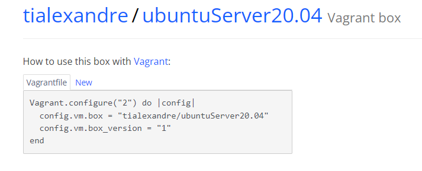

# Obtencion de la maquina

> Buscamos la maquina que queremos utilizar en [vagrant](https://portal.cloud.hashicorp.com/vagrant/discover)

> En mi caso he utilizado una maquina llamada [ubuntuServer20.04](https://app.vagrantup.com/tialexandre/boxes/ubuntuServer20.04) de tialexandre.


 

# Configuración de la maquina

1. Primero utilizaremos el comando **vagrant box add** junto con la maquina que queramos agregar **(tialexandre/ubuntuServer20.04)**.
2. Ahora utilizaremos el comando completo, por lo que nos quedará **vagrant box add tialexandre/ubuntuServer20.04** 
3. Una vez que tenemos la maquina utilizaremos **vagrant init** para generar nuestro archivo **Vagrantfile** 
4. Ahora la configurararemos mediante el fichero **Vagrantfile** 


 #### El ejercicio nos pide 5 requisitos

 1. El **sistema** es un **Ubuntu Server 20.04**
 2. El **nombre de la maquina** será **Ubuntu Server**
 3. Tendrá asignados **2GB de RAM y 2 cores virtuales**
 4. El **nombre del equipo** tiene que ser **"Server-iniciales"**
 5. Tiene el **directorio /data** de la maquina virtual sincronizado con uan carpeta que se creará en el mismo directorio que nuestro **VagrantFile** 

#### Por lo cual aquí abajo tendremos nuestro archivo **VagrantFile** creado correctamente.

```ruby
Vagrant.configure("2") do |config|
  config.vm.box = "tialexandre/ubuntuServer20.04"
  config.vm.hostname = "server-AMR"
  config.vm.synced_folder "data", "/data"
  config.vm.provider "VirtualBox" do |vb|
    vb.name = "Ubuntu Server"
    vb.memory = "2048"
    vb.cpus = 2
    
  ende
```