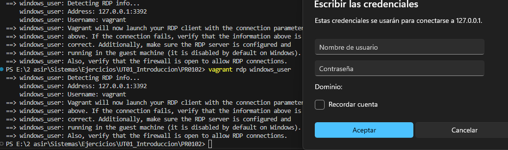
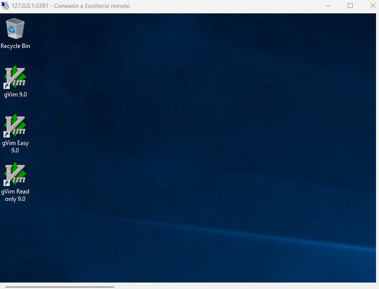

# Obtencion de la maquina

> Para este ejercicio utilizaremos dos maquinas [jborean93/WindowsServer2019](https://app.vagrantup.com/jborean93/boxes/WindowsServer2019) y la [inclusivedesign/windows10-eval](https://app.vagrantup.com/inclusivedesign/boxes/windows10-eval)


# Requisitos y configuración

Tendrá dos máquinas virtuales con los siguientes sistemas operativos y características:
1. **Windows Server 2019 Standard** 
  
   4GB de RAM
  
    4 cores virtuales

2. **Windows 10**
   
    2GB de RAM

    2 cores virtuales

Las máquinas virtuales deberán estar interconectadas entre sí.

Se debe poder acceder desde equipo anfitrión a las máquinas virtuales mediante Escritorio remoto.

 #### VagrantFile configurado


```ruby

Vagrant.configure("2") do |config|

  config.winrm.transport = "plaintext"
  config.winrm.basic_auth_only = true

  config.vm.define "windows_server" do |ws|
    ws.vm.box = "jborean93/WindowsServer2019"
    ws.vm.hostname = "windowsserver"
    ws.vm.boot_timeout = 20
    ws.vm.network "private_network", ip: "192.168.1.10", netmask: "255.255.255.0"

    ws.vm.network "forwarded_port", guest: 3389, host: 3391, auto_correct: true

    ws.vm.provider "virtualbox" do |vb|
      vb.memory = "8192"
      vb.cpus = 2
    end
  end

  config.vm.define "windows_user" do |wuser|
    wuser.vm.box = "inclusivedesign/windows10-eval"
    wuser.vm.hostname = "windows10"
    wuser.vm.network "private_network", ip: "192.168.1.11", netmask: "255.255.255.0"
    wuser.vm.communicator = "winrm"
    wuser.vm.boot_timeout = 20
    wuser.vm.network "forwarded_port", guest: 3389, host: 3392, auto_correct: true

    wuser.vm.provider "virtualbox" do |vb|
      vb.memory = "6144"
      vb.cpus = 2
    end
  end
end

```

Una vez configurado el archivo VagrantFile solamente tendremos que ejecutar el comando **vagrant up** y conectarnos a la maquina mediante **vagrant rdp** *"nombre de la maquina"*

## 

#### Comprobación de que funciona RDP 


##### Aqui nos habriamos conectado ya por RDP


[Volver al inicio](./../../index.md)