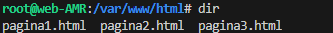
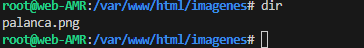
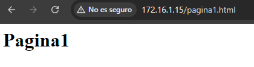
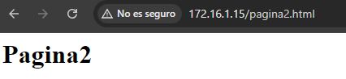
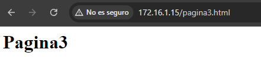

# Obtencion de la maquina

> Buscamos la maquina que queremos utilizar en [vagrant](https://portal.cloud.hashicorp.com/vagrant/discover)

> En mi caso he utilizado una maquina llamada [generic/ubuntu2004](https://app.vagrantup.com/generic/boxes/ubuntu2004)


# Configuración de la maquina

1. Primero utilizaremos el comando **vagrant box add** y la maquina **(generic/ubuntu2004)**. 
2. Una vez que tenemos la maquina utilizaremos **vagrant init** para generar nuestro archivo **Vagrantfile** 
3. Ahora la configurararemos mediante el fichero **Vagrantfile** 


 #### El ejercicio nos pide 7 requisitos

1. El sistema operativo será un **Ubuntu 22.04**
2. El nombre de la maquina será **Web server**
3. Tendrá asignados **3GB RAM** y **2 cores virtuales**
4. Nombre del equipo será **web-iniciales**
5. Tendra un **adaptador de red privado** cuya IP pertenece a la red **172.16.0.0/16**
6. Tendra un **adaptador de red publico** cuya IP pertenece a la red **10.99.0.0/16**

#### Por lo cual aquí abajo tendremos nuestro archivo **VagrantFile** creado correctamente.

```ruby
Vagrant.configure("2") do |config|
  config.vm.box = "generic/ubuntu2004"
  config.vm.hostname = "web-AMR"
  config.vm.network "private_network", ip: "172.16.1.15", netmask: "255.255.0.0"
  config.vm.network "public_network", ip: "10.99.1.2", netmask: "255.255.0.0"
  config.vm.synced_folder "C:\\Users\\Administrator\\Desktop\\carpetacompartida", "/var/www/html"
  config.vm.provider "Virtualbox" do |vb|
    vb.name = "Web server"
    vb.memory = "3072"
    vb.cpus = 2
  end
  end
```

Una vez configurado el archivo VagrantFile solamente tendremos que ejecutar el comando **vagrant up** y conectarnos a la maquina mediante **vagrant ssh**

## Apache

### Instalación de apache

Para instalar apache en primero tendremos que ejecutar el comando **sudo apt-get update** y cuando termine podremos utilizar el comando **sudo apt-get install apache2**, de esta forma tendremos apache descargado y podremos empezar a hacer pruebas.

### Configuración de Apache
Primero nos iremos a la carpeta **/var/www/html** y borraremos el archivo **index.html** debido a que es el creado por el propio software, una vez hecho esto deberemos crear en la carpeta **C:\\Users\\Administrator\\Desktop\\carpetacompartida** de **nuestra maquina fisica** tres paginas web y subir una imagen. De forma que nuestra carpeta tendria estos contenidos.



Ahora comprobaremos que tambien se ha subido la imagen en **var/www/html/imagenes**


## Comprobación final
Realizamos una comprobación verificando que todas las paginas existen 

**Pagina 1**

**Pagina 2**

**Pagina 3**

**Imagen**


[Volver al inicio](./../../index.md)