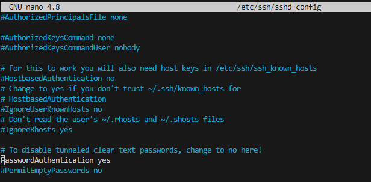

# PR0202 PR0202: Conexión remota con SSH

## 1. Preparación de la máquina y configuración de red
### Añadir modo red solo anfitrión

#### Modificaremos nuestra red para que este en modo solo anfitrión y comprobaremos la conectividad entre nuestro equipo y la maquina.

#### La ip asignada por virtualbox será la **192.168.56.0/24** pero nosotros le asignaremos la **192.168.1.10**

### Comprobar conectividad
#### 

### Realizar cambios necesarios para que resuelva localmente nombre del servidor


#### Cambio del hostname del equipo 

#### Usaremos el comando **nano /etc/hostname** y editaremos el /etc/hostname 
```bash
nano /etc/hostname
```

## 2. Creación del usuario y conexión SSH
### Crear usuario (iniciales)_ssh donde las iniciales son las de tu nombre y apellidos.

Usaremos la sucesión de comandos:
```bash
sudo useradd -s /bin/bash AMRssh
sudo passwd AMRssh
```

### Realizar pasos necesarios para conectarse mediante SSH usando contraseña

Primero descomentaremos la linea 
```bash
#PasswordAuthentication yes
```


Ahora guardaremos los cambios y reiniciaremos el servicio SSH mediante el uso de **sudo systemctl restart ssh**

Trataremos de conectarnos


Ahora para conectarnos sin necesidad de contraseña desde nuestro otro equipo usaremos una sucesión de comandos
```bash
scp /home/amrssDh/.ssh/id_rsa.pub amrssDh@192.168.1.10:/home/amrssDh/.ssh/
```
Una vez realizado este comando desde la maquina host usando el usuario amrssDh pasaremos la id_rsa.pub a un fichero nuevo llamado **authorized_keys**

Luego probaremos la conexión mediante ssh y veremos como nos deja acceder sin necesidad de contraseña

[Volver al inicio](./../../index.md)