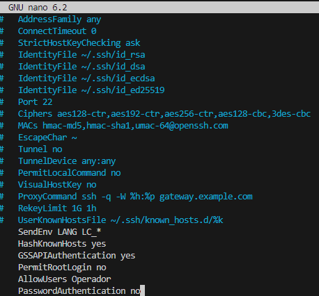

### Ejercicio 1

Suponemos que nuestro usuario en Ubuntu Server quiere hacer una copia de seguridad local diaria de los datos contenidos en su directorio personal.

Realiza y documenta los pasos necesarios para conseguir este objetivo utilizando cron y `rsync`. Puedes tomar las decisiones que consideres necesarias (p.e. directorios, …) , pero tomando la precaución de documentarlas

### Ejercicio 2

Vamos a realizar ahora una copia de seguridad remota. Utilizarás el Ubuntu Server para alojar la copia de seguridad y la máquina virtual con Linux Mint como origen de la copia de seguridad.

Tienes que realizar todos los pasos necesarios para mantener en el servidor una copia de seguridad del contenido del directorio `Documentos` del usuario del cliente.

Debes tener en cuenta lo siguiente:
- Debes documentar los pasos más importantes y las decisiones que tomes.
- En el servidor vas a crear un usuario específico como operador de copias de seguridad.
- Es tu decisión la carpeta del servidor donde alojarás las copias de seguridad, pero debes asegurarte de tener los permisos correctamente configurados para que únicamente el operador de copias de seguridad pueda acceder a ellos.
- También debes configurar SSH en el servidor con las siguientes características:
    - No debe permitir el acceso remoto al usuario root
    - Solamente puede acceder el usuario operador de las copias de seguridad
    - El acceso debe ser transparente para el usuario, es decir, no debe solicitar la contraseña al acceder por SSH
- Para comprobar que funciona debes programar la copia de seguridad para que se realice cada 2 minutos.
- Comprueba que funciona. Crea un fichero en el directorio Documents y espera un par de minutos. Luego verifica que dicho fichero se ha actualizado en el directorio de la copia de seguridad.


# Ejercicios

## Ejercicio 1

Primero crearemos el directorio `backups` en el directorio personal de `vagrant`, por lo que usaremos el comando `mkdir /home/usuario/backups` 

Ahora realizaremos la copia de seguridad con `rsync`, la linea que usaremos será `rsync -av /home/vagrant/ /home/vagrant/backups`.

Ahora editaremos el archivo cron usando `crontab -e` y añadiremos la siguiente linea para ejecutar la copia a las 3AM todos los dias.

`0 3 * * * rsync -av --delete /home/vagrant/ /home/vagrant/backups/`

Ahora verificaremos que la tarea cron esta creada usando `crontab -l`

## Ejercicio 2

Creamos un usuario "operador" con el comando `sudo adduser operador`

Ahora crearemos una carpeta backup en el directorio de nuestro usuario "operador"

`sudo mkdir /home/operador/backups`

Ahora le daremos a la carpeta permisos totales al dueño de la carpeta usando `sudo chmod 700 /home/operador/backups`

Ahora editaremos el archivo `sshd_config` para que cumpla con los requisitos del ejercicio.
En este caso añadiremos tres lineas

```bash
PermitRootLogin no
AllowUsers operador
PasswordAuthentication no
```



Reiniciaremos el servicio SSH usando `sudo systemctl restart ssh` y generaremos claves SSH para crear la transparencia.

Esto ultimo lo haremos mediante el comando `ssh-keygen` y acto seguido el uso de `scp /home/operador/.ssh/id_rsa.pub vagrant@10.0.2.15:/home/operador/.ssh/` 

Ahora realizaremos la copia de seguridad desde la maquina cliente usando el comando
`rsync -av /home/vagrant/backups/ -e ssh operador@10.0.2.15:/home/operador/`

Por ultimo desde nuestra maquina host usaremos el comando `crontab -e` para añadir la siguiente linea dentro del mismo
`*/2 * * * * rsync -av /home/vagrant/backups/ -e ssh operador@10.0.2.15:/home/operador/`

Para verificar que la copia de seguridad se ha realizado usaremos `ls /home/operador/`

[Volver al inicio](./../../index.md)