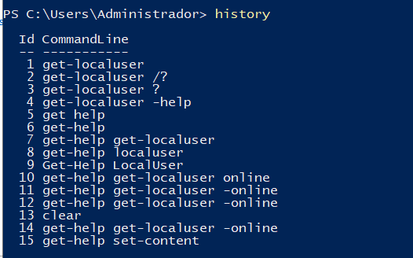

# PR0401: Introducción a Powerhsell

Realiza las siguientes tareas que se te piden utilizando Powershell. Para contestar lo mejor es que hagas una captura de pantalla donde se vea el comando que has introducido y las primeras líneas de la salida de este.

1. Obtén ejemplos de utilización del comando `Get-LocalUser`.
   
Para esto usaremos el comando `Get-Help Get-LocalUser`

2. Obtén un listado de todos los comandos relacionados con la gestión de usuarios locales (es decir, con el nombre `LocalUser`).

Al igual que el ejercicio anterior usaremos el comando `Get-Help` pero en este caso junto con `LocalUser` por lo que nuestro comando quedaría así: `Get-Help LocalUser`

3. Utilizando la línea de comandos, muestra en el navegador la ayuda del comando `Get-LocalUser`.

Usaremos el comando `Get-Help Get-LocalUser -online` para que se nos abra la ayuda desde el navegador.

4. Averigua para qué sirve el comando `Set-Content` y explícalo brevemente con tus palabras.
   
El comando sirve para escribir contenido nuevo o reemplazar contenido existente en un archivo.

5. Explica tres formas diferentes de ver o buscar un comando que hayas utilizado anteriormente en tu sesión.

Escribimos `history`, `invoke-history` y `get-history` y nos saldrán los comandos utilizados anteriormente

6. Averigua si el comando `Get-Process` tienen un parámetro llamado `ComputerName` y en caso afirmativo explica para qué sirve.

Si existe, pero tendremos que usar `Get-Help Get-Process -Full`  

Este comando nos sirve para especificar el nombre del ordenador remoto de la que quieres obtener informacion sobre los procesos.

7. Muestra la ayuda del comando `Start-Process` en una ventana emergente.

Esto lo conseguiremos gracias al comando `Get-Help Start-Process -ShowWindow`   

8.  Muestra la ayuda del comando `Get-Help` en el navegador invocándolo desde la línea de comandos.

Usaremos el comando: `Get-Help Get-Help -Online`

9.  Muestra las últimas 20 entradas del historial.
    
Mostraremos las ultimas 20 entradas del historial mediante el comando: `Get-History -count 20`

10.   Elimina las entradas 10, 12 y 14 de tu historial.

Gracias al comando `Clear-History -id 10`, `Clear-History -id 12` y `Clear-History -id 14` podemos borrar las entradas con los identificadores 10, 12 y 14

[Volver al inicio](./../../index.md)