# PR0402: Introducción a Powershell (II)

Realiza las siguientes tareas que se te piden utilizando Powershell. Para contestar lo mejor es que hagas una captura de pantalla donde se vea el comando que has introducido y las primeras líneas de la salida de este.

1. Visualiza las últimas cinco entradas del historial, mostrando para cada una el comando, la hora en que finalizó su ejecución y el estado de ejecución.
   
   `get-history | Select-Object -last 5 | Format-Table commandline, endexecutiontime, executionstatus`
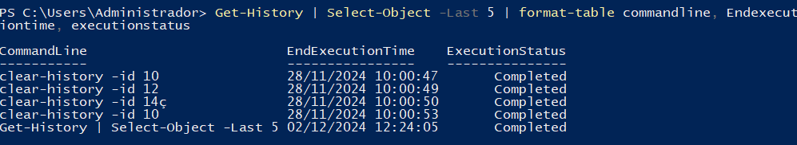

1. Ejecuta el comando `Get-Command` (que muestra todos los comandos disponibles en Powershell) e interrúmpelo antes de que finalice su ejecución pulsando las teclas Ctrl-C. A continuación, ejecútalo dejando que finalice correctamente.

Ejecutamos `Get-Command` y usamos `ctrl + c`
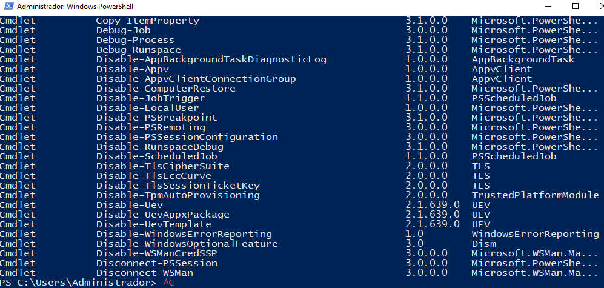

Ahora ejecutamos `Get-Command` finalizandose correctamente
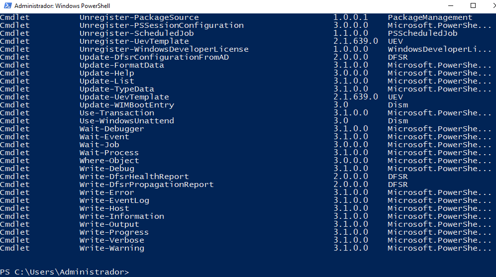

2. Vuelve a ejecutar el comando del punto 1 y comprueba las diferentes salidas de finalización de estado de ejecución.
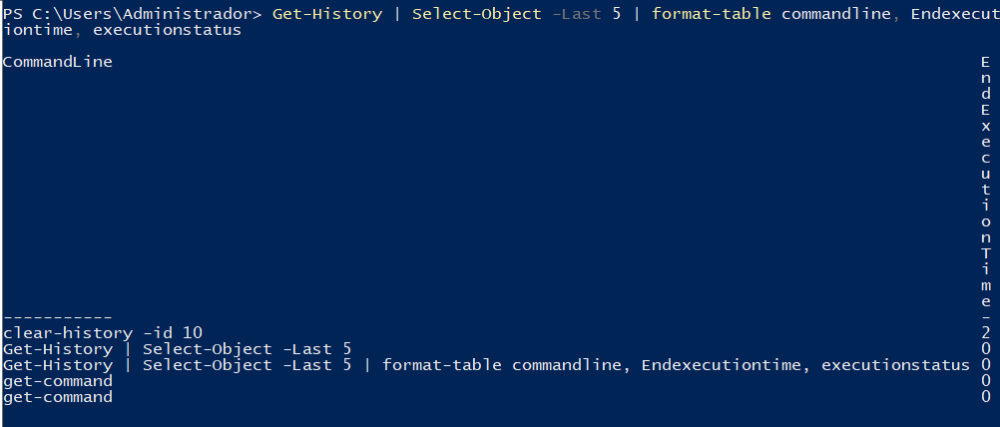

3. Muestra todos los procesos con el nombre `msedge` mostrando para cada uno el identificador, el consumo de CPU y los hilos (*threads*)
   
`Get-Process -Name msedge | Select-Object Id, CPU, Threads`
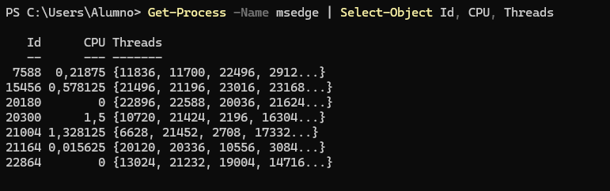

4. Averigua para qué sirve el parámetro `-Delimiter` del comando `Export-CSV`

Sirve para especificar que los datos van a ser delimitados por un caracter

5. Muestra en una ventana la ayuda del comando `Get-History`

`get-help get-history -showwindow`
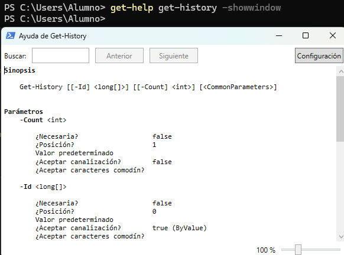

6. Muestra un listado con todos los comandos que tengan el verbo `Update`.
   
Esto lo conseguiremos gracias al parametro `-verb` en el comando `get-command`
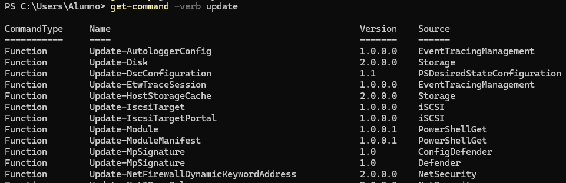

7. Ejecuta la herramienta **Recortes** y localízala usando el comando `Get-Process` teniendo en cuenta que el proceso se llama `SnippingTool.exe` 
   
   Usaremos el comando `get-process -name snippingtool`
   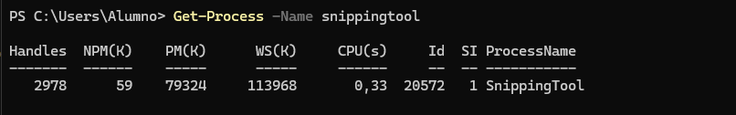

8. Averigua qué propiedades tienen los procesos devueltos con el comando `Get-Process`.
   `Get-Process | Get-Member`
    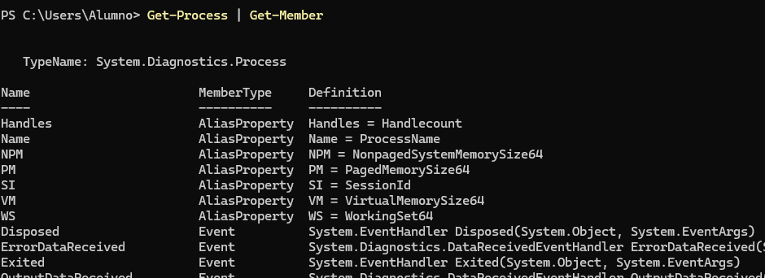

9.  Busca en la ayuda para qué sirve el parámetro `-MemberType` del comando `Get-Member`.

    Usaremos el comando `Get-Help Get-Member -Parameter MemberType` y sirve para especificar el tipo de miembros que deseamos filtrar.

10. Desde la línea de comandos, finaliza la ejecución de la herramienta **Recortes**.
    
    Usaremos el comando `Stop-Process -Name SnippingTool`
    

11.  Muestra todos los procesos que tienen el nombre `svchost`.

    `Get-Process -Name svchost`
    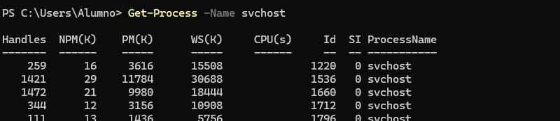

12.  Muestra por pantalla el número de instancias del proceso `svchost`.

    `(Get-Process -Name svchost).Count`
    

13.   Muestra por pantalla todos los procesos con el nombre `svchost` mostrando para cada uno: nombre, identificador, hora de inicio, tiempo total de procesador y clase de prioridad. Se deben mostrar de **forma tabular**.

`get-process -name svchost | select-object Name, Id, StartTime, CPU, PriorityClass | Format-Table`
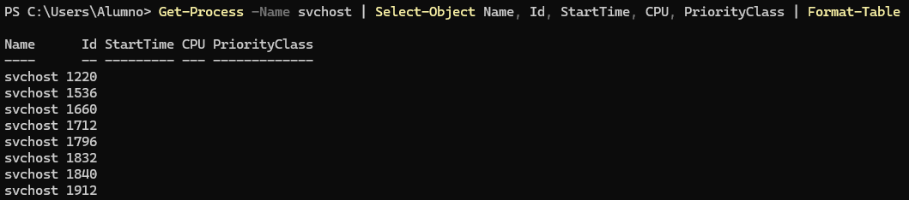

14.   Repite la búsqueda anterior, pero ordenando por el campo tiempo total de procesador en sentido descendente.
`Get-Process -Name svchost | Select-Object Name, Id, StartTime, CPU, PriorityClass | Sort-Object CPU -Descending | Format-Table`
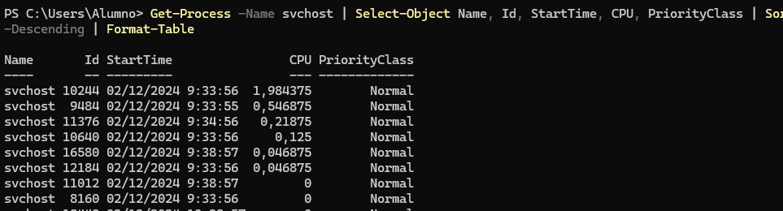

15.   Muestra los usuarios que hay en el sistema agrupándolos por la propiedad `Enabled`.

`Get-LocalUser | Group-Object -Property Enabled`
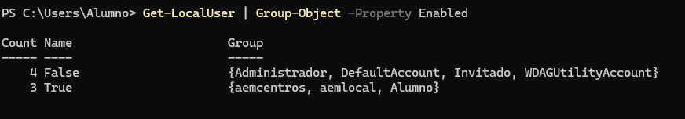

16.   Muestra los usuarios que hay en el sistema con la cuenta habilitada (propiedad `Enabled` puesta a `True`). Utiliza el filtrado con el comando `Where-Object`

`Get-LocalUser | Where-Object Enabled -eq $true`

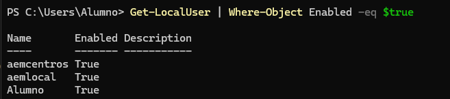

17.    Muestra un listado de todos los usuarios del sistema con el nombre y la fecha de la última vez que iniciaron sesión (tienes que buscar la propiedad que indique último inicio de sesión o *last logon*)

`Get-LocalUser | Select-Object Name, LastLogon`
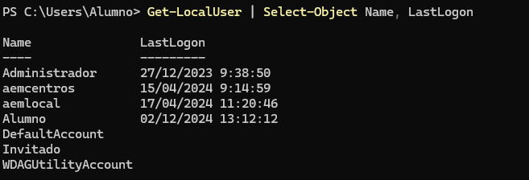
