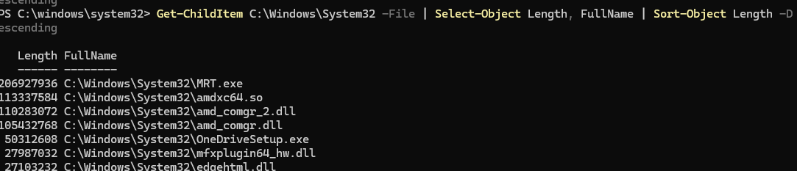

# PR0402: El pipeline en Powershell

Realiza las siguientes tareas que se te piden utilizando **Powershell**. Para contestar lo mejor es que hagas una captura de pantalla donde se vea el comando que has introducido y las primeras líneas de la salida de este.

1. El comando `Get-Date` muestra la fecha y hora actual. Muestra por pantalla únicamente el año en que estamos.

`get-date -format "yyyy"`

2. Uno de los requisitos de Windows 11 es que es procesador tenga **TPM** habilitado. Powershell dispone del comando `Get-TPM` que nos muestra información sobre este módulo. Muestra por pantalla, en formato tabla, las propiedades `TpmPresent`, `TpmReady`, `TpmEnabled` y `TpmActivated`.
   
`Get-Tpm | Select-Object TpmPresent, TpmReady, TpmEnabled, TpmActivated | Format-Table`

En los siguientes ejercicios trabajaremos con los ficheros devueltos por el comando `Get-ChildItem C:\Windows\System32`.

3. Muestra por pantalla el número de ficheros y directorios que hay en ese directorio.
`(Get-ChildItem C:\Windows\System32).Count`

4. Los objetos devueltos por el comando anterior tienen una propiedad denominada `Extension`, que indica la extensión del archivo. Calcula el número de ficheros en el directorio que tienen la extensión `.dll`.
   
`(Get-ChildItem C:\Windows\System32 -File | Where-Object {$_.Extension -eq ".dll"}).Count`

5. Muestra los ficheros del directorio con extensión `.exe` que tengan un tamaño superior a 50000 bytes.
   
`Get-ChildItem C:\Windows\System32 -File | Where-Object {$_.Extension -eq ".exe" -and $_.Length -gt 50000}`

6. Muestra los ficheros de este directorio que tengan extensión `.dll`, ordenados por fecha de creación y mostrando únicamente las propiedades de fecha de creación (`CreationTime`), último acceso (`LastAccessTime`) y nombre (`Name`).
   
`Get-ChildItem C:\Windows\System32 -File | Select-Object Length, FullName | Sort-Object Length -Descending`

7. Muestra el tamaño (`Length`) y nombre completo (`FullName`) de todos los ficheros del directorio ordenados por tamaño en sentido descendente.
   
`Get-ChildItem C:\Windows\System32 -File | Select-Object Length, FullName | Sort-Object Length -Descending`

8. Muestra el tamaño y nombre completo de todos los ficheros del directorio que tengan un tamaño superior a 10MB (10000000 bytes) ordenados por tamaño.

`Get-ChildItem C:\Windows\System32 -File | Where-Object {$_.Length -gt 10000000} | 
Select-Object Length, FullName | Sort-Object Length`

9.  Muestra el tamaño y nombre completo de todos los ficheros del directorio que tengan un tamaño superior a 10MB y extensión `.exe` ordenados por tamaño.
    `Get-ChildItem C:\Windows\System32 -File | Where-Object {$_.Extension -eq ".exe" -and $_.Length -gt 10000000} | Select-Object Length, FullName | Sort-Object Length`

10.   Muestra todos los procesos que tienen el estado `Responding` puesto a `False`, es decir, todos los procesos del sistema que se hayan colgado.

`powershell
Get-Process | Where-Object {$_.Responding -eq $false}`

1.    Muestra todos los ficheros de `C:\Windows` que hayan sido creados con fecha posterior al 15 de octubre de este año.

`Get-ChildItem -Path C:\Windows -Recurse -File | Where-Object { $_.CreationTime -gt (Get-Date "2024-10-15") }`

[Volver al inicio](./../../index.md)