# PR501 

# PR0501: Carpetas personales y compartidas por un grupo

Realiza los siguiente pasos en tu dominio:

## Creación de usuarios y grupos

- Crea en tu dominio los usuarios `aperez` y `fgonzalez`.

Creamos los usuarios "**aperez**" y "**fgonzalez**"

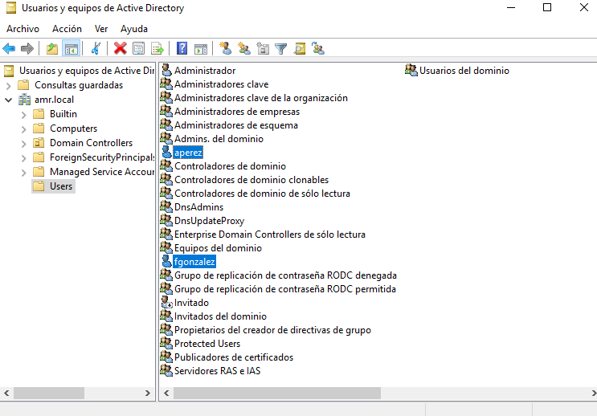

- Crea un grupo global denominado `alumnos` y agrega los usuarios que creaste anteriormente.

Ahora creamos el grupo "**alumnos**"

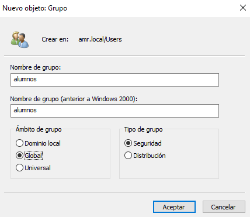

Agregamos los usuarios "**aperez**" y "**fgonzalez**" al grupo "**alumnos**"

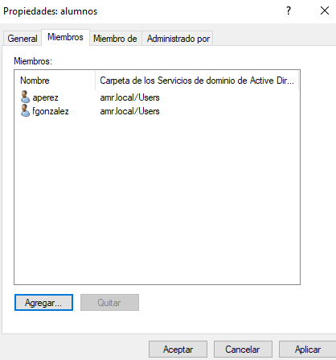 

## Carpetas personales

- Instala el *Administrador de recursos del servidor de archivos* que está dentro del rol *Servicios de archivos y almacenamiento*
  
  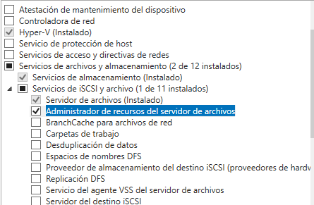

- Utilizando la herramienta *Servicios de archivos y de almacenamiento* del *Administrador del servidor*, crea una carpeta para cada usuario dentro de `C:\shares` y realiza los pasos necesarios para que ambos usuarios puedan ver esta carpeta como una unidad de red identificada con la letra `H:`
  
Primero accedemos a la pestaña "**Servicios de archivos y de almacenamiento**"
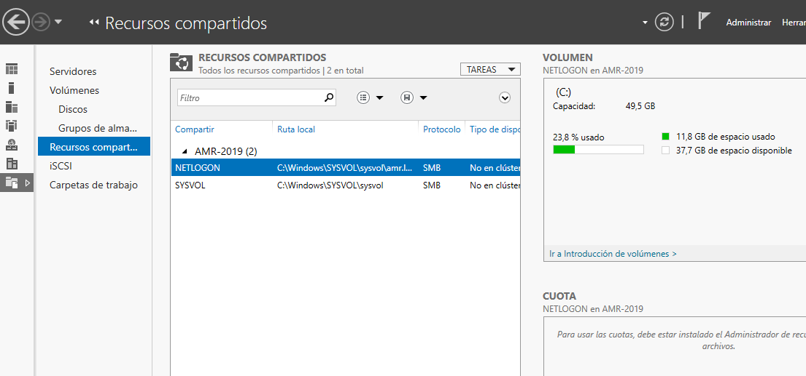

Ahora crearemos la carpeta
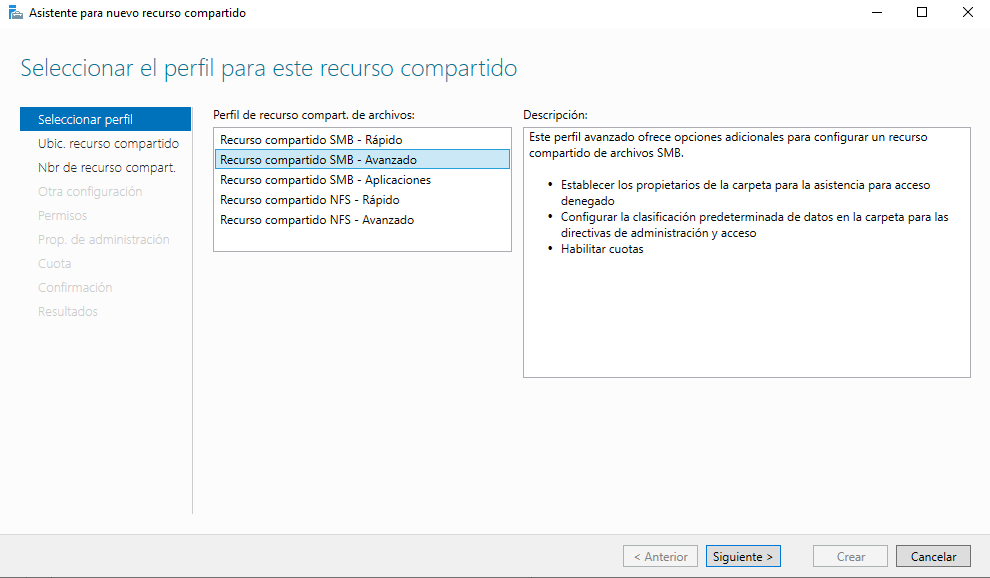

Le damos a next
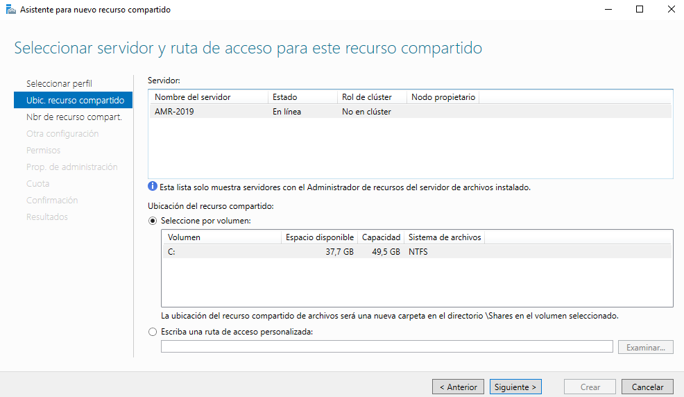

Creamos el recurso compartido **"Personal"**
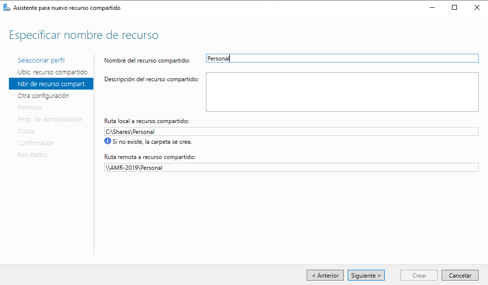

Ahora haremos las ultimas configuraciones.
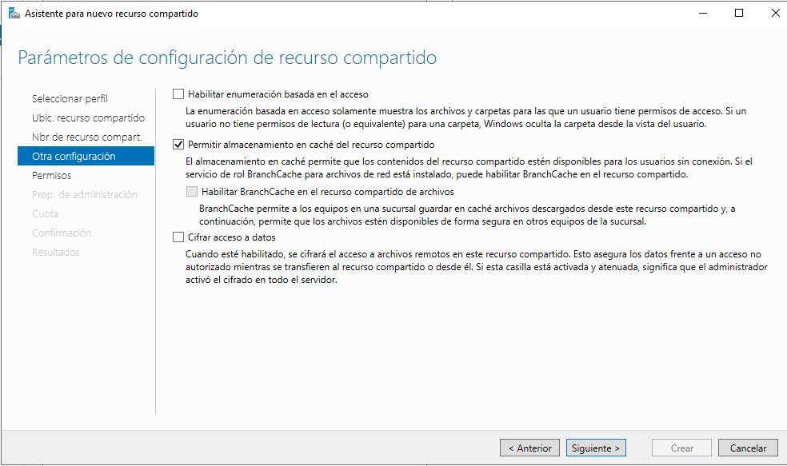

Después en permisos tendremos que establecer que los "**Usuarios del dominio**" tenganz control total de la carpeta.
Aqui cambiaremos **"Todos"** por **"Usuarios del dominio"**
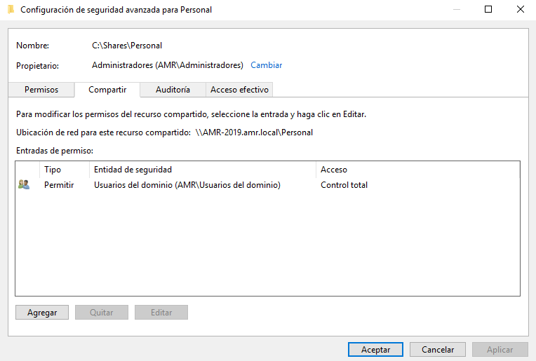

Estableceremos las propiedades de administración de carpeta
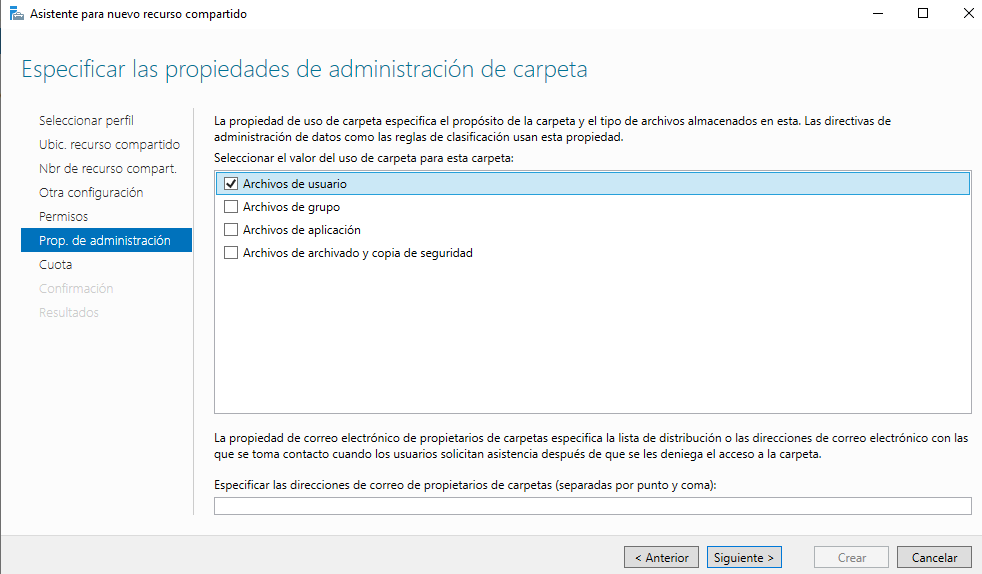

Dejaremos las cuotas sin establecer 
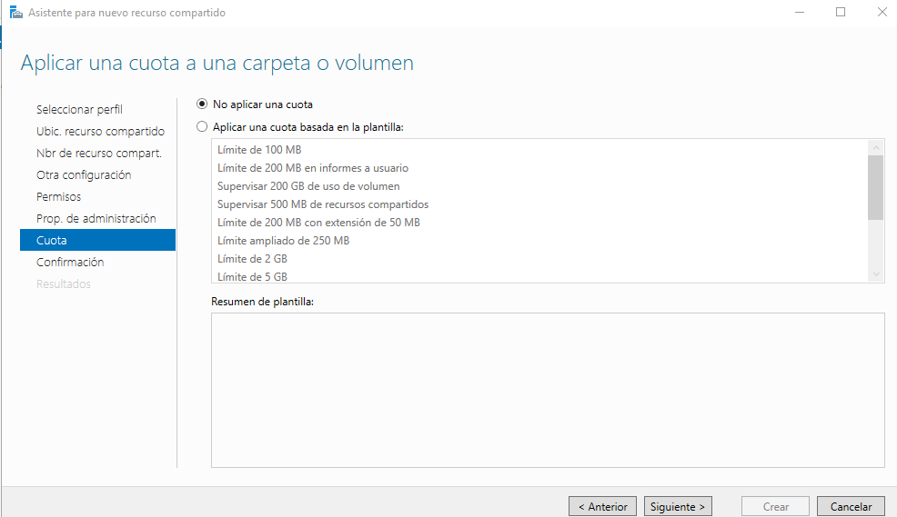

Creamos el recurso compartido.
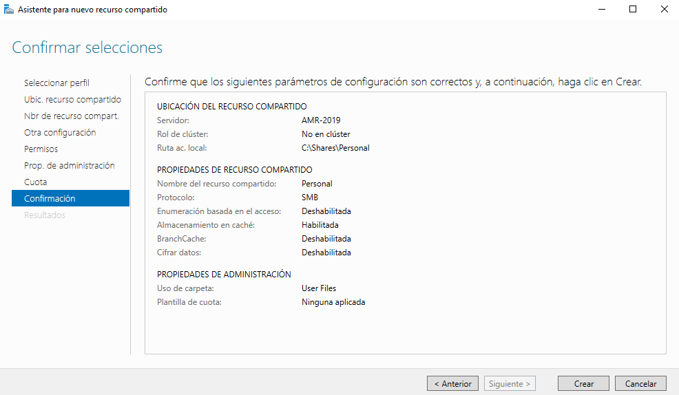

Ahora desde el panel de usuarios, seleccionaremos todos los usuarios (en este caso) **aperez** y **fgonzalez**. 
En la pestaña "**perfil**" seleccionaremos "**carpeta particular**" y seleccionaremos el cuadro "**Conectar**".

## Carpetas compartidas por un grupo

- Crea en `C:\shares` una carpeta llamada `apuntes` y realiza las tareas necesarias para que los usuarios del grupo `alumnos` puedan acceder a ella como un espacio de almacenamiento compartido.

Crearemos otro recurso compartido de la misma manera, en los permisos de compartir pondremos el grupo alumnos y le damos **control total**.
## Entrega de la tarea

Debes documentar los pasos más relevantes de la misma y entregarla en el repositorio.